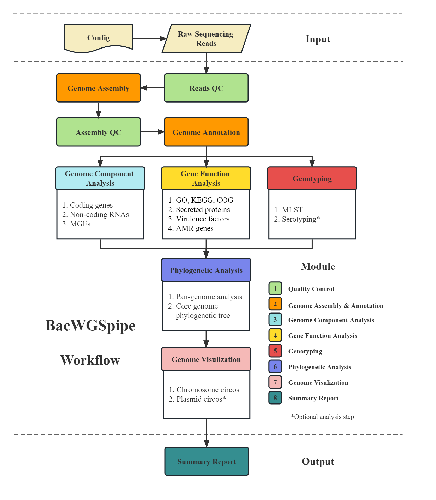

# BacWGSpipe

A Snakemake workflow for a complete analysis of bacterial whole-genome sequencing data.

## Data Sources

BacWGSpipe supports three types of WGS data sources:
    
1. **Short**: Illumina short reads 
2. **Long**: Long reads (either PacBio or Nanopore) 
3. **Hybrid**: Illumina short reads + Long reads (either PacBio or Nanopore) from the same isolate
   - This hybrid mode enables us to get complete assembly sequences of both chromosome and plasmid.
	
## Workflow Structure

<p align="center">
  
</p>

## Dependencies

To simplify the installation step as much as possible, most of the dependencies including databases and tools have been 
pre-installed in several docker images, except for the following two databases due to the large file size. Please manually 
download the database files and modify the corresponding path in config file.

1. Kraken2 database: 
   - Download PlusPF database from https://genome-idx.s3.amazonaws.com/kraken/k2_pluspf_20230314.tar.gz and decompress
   - Modify "**kraken2_db**" in config file (default: config/config.yaml)
1. EggNOG-mapper database:
   - Read "Installation - Setup" section in https://github.com/eggnogdb/eggnog-mapper/wiki/eggNOG-mapper-v2.1.5-to-v2.1.10#user-content-Overview
   - Modify "**eggnog_mapper_database**" in config file (default: config/config.yaml)

## Workflow Usage

1. Clone the repository:

    ```bash
    git clone git@github.com:KevinLYW366/BacWGSpipe.git
    ```
2. Put all samples' sequencing data in a directory (long reads and short reads sequencing data separately) and generate 
a list file of sample names.

3. Modify following items in Config file (default: config/config.yaml) based on project information every time before running the workflow.
   - 3.1 everything in "Data input" section;
     - Note: "seqdata_source" should match the data source you would input to the workflow. If the mode of Illumina short reads ONLY was selected, nothing in "Long reads" needs to be modified, and vice versa.
   - 3.2 "threads" in "Analysis - Global" section (Threads used by tools for each sample);
   - 3.3 feel free to modify some analysis thresholds if you know what they mean, such as "plsdb_max_pvalue", "plasmidfinder_mincov" and ... in "Analysis" section.

4. Set up the snakemake environment:

    ```bash
    # Add conda channels
    conda config --add channels defaults
    conda config --add channels bioconda
    conda config --add channels conda-forge
      
    # Install mamba first (mamba provides a faster and more roboust way for conda packages installation)
    conda install -n base -c conda-forge mamba
      
    # Install snakemake using mamba
    mamba create -c conda-forge -c bioconda -n snakemake snakemake=7.25.3
    ```
5. Set up the singularity environment (please refer to https://docs.sylabs.io/guides/4.0/user-guide/quick_start.html#quick-installation-steps).
Snakemake uses Singularity to download and load the docker images (defined in "Images" section in config file) which contain workflow dependencies.

6. Run the whole pipeline using one bash script (BacWGSpipe.sh):

    ```bash
    # Move to the directory of BacWGSpipe
    cd /path/to/BacWGSpipe
   
    # Activate the conda environment of Snakemake
    conda activate snakemake
   
    # Run BacWGSpipe
    # Note: 1. Don't forget to bind the path of directories containing files which will be used when BacWGSpipe runs, 
    #       including BacWGSpipe workflow, sequencing data, two databases manually downloaded and etc. 
    #       2. Please use the parameter "--singularity-args" to bind path, e.g. --singularity-args "-B /lvdata/lyw:/lvdata/lyw" 
    #       (then all the files in /lvdata/lyw will be available in Singularity container). Multiple paths could be binded using
    #       several "-B"s.
    bash BacWGSpipe.sh --configfile config/config.yaml -r -p --cores 32 --singularity-args "-B /lvdata/lyw:/lvdata/lyw" -n 
    ```

## Test dataset

V. Murigneux et al., “MicroPIPE: Validating an end-to-end workflow for high-quality complete bacterial genome construction,” BMC genomics, vol. 22, no. 1, p. 474, 2021.

- 12 ST131 Escherichia coli strains with both Nanopore long-read sequencing data (SRA accession: SRP293329) and Illumina short-read sequencing data (SRA accession: ERP001354).

## Author

Yewei Lu (lyw@cwmda.com)

Xiangchen Li (lxc@cwmda.com)

